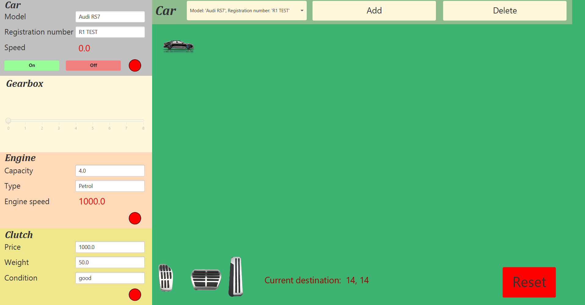
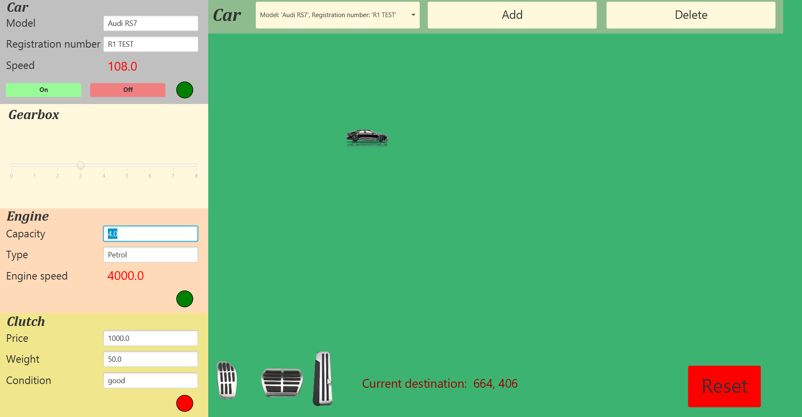
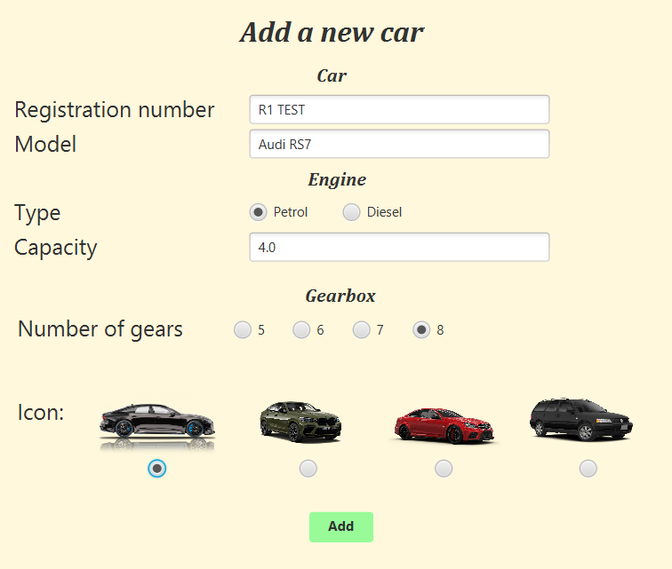

# car-javafx
## car simulator; JavaFX, threads

This simulator is the part of the object-oriented programming course. Car can move only if the engine is started and gear is active.
It is possible to increase/deacrease car's speed if it is moving. 
Car stops when destination is reached.

### user interface

### car customization

